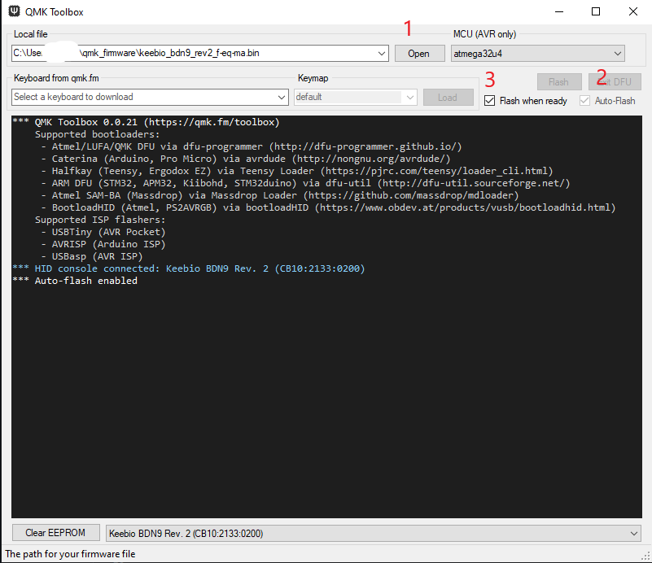
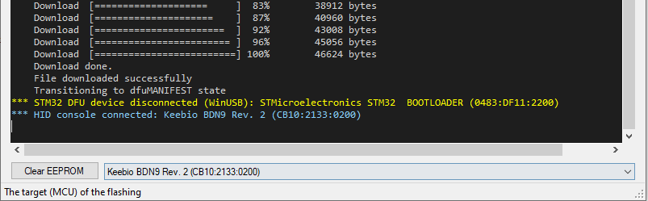

# Introduction
I wanted a project to practice soldering keyboards and get familar with QMK in prep for building my first mechanical keyboard. My goal was to have a macro pad that can control iTunes.  

The [BDN9](https://keeb.io/products/bdn9-3x3-9-key-macropad-rotary-encoder-support) board from Keebio ticked all of the check boxes.
* 9 key switches to solder
* Supported up to 3 encoders (top-row)
* Firmware was supported by QMK
* Bonus LEDS!
* Cheap!\*

\* *Cheap is very relative...I probably have $60 in this project.*  

The reason for using AutoHotKey to intercept Function keys is due to the fact that AutoHotKey can search for minimized Windows applications (aka iTunes), activate that window, pass the key strokes, then return to the original Windows application.   This allows me to be working in a PuTTy window, have a bad song come up, and quickly skip it, without really impacting my active window/work-flow.

So, I use QMK to map the BDN9 keys to the higher Function keys (F14 - F24) since these are not actually on my current keyboard.  Then use AutoHotKey to intercept those Function keys and convert them to iTunes shortcuts.  

For example:  
BDN9 middle-right button -> F19 (QMK) -> AutoHotKey (activates iTunes, passes in cntl-right) -> Song is skipped -> AHK returns control to original active window  

This github project has the associated QMK and AutoHotKey files for my BDN9 macro board.  
Tested only on Windows 10  

# Layers
I have two layers.  The base layer controls iTunes (mostly) and Volume controls.  Some LED controls (cycle through RGB modes, on/off) with the right encoder.  The second layer has the encoders setup to change the LED hue (colors) and the speed of LED transitions.  Some buttons on the second layer will fall back to the base layer so I can still control iTunes, but others will change the LED modes.

When in the second layer, the "underglow" LEDs will turn red (hard to see, honestly)

## Layer 0 (\_BASE)
```
    /*
        | Knob 1: Vol Dn/Up   |                       | Knob 2: RBG+        |
        | Press: Mute         | F16 (AHK controlled)  | Press: RBG off/on   |
       	---------------------------------------------------------------------
        | F14 (AHK controlled)| F17 (AHK controlled)  | F19 (AHK controlled)|
        ---------------------------------------------------------------------
        | Toggle(1)           | F18                   | F20                 |
     */
```

## Layer 1 (\_LED)
```
    /*
        | Knob 1: Hue        |                    | Knob 2: LED Speed  |
        | Press: Mute        | (Falls to layer 0) | Press: RBG off/on  |
      	---------------------------------------------------------------
        | RGB Mode Plain     | RGB Mode Breathing | (Falls to layer 0) |
	      ---------------------------------------------------------------
        | (Falls to layer 0) | RGB Mode Swirl     | RGB Mode Rainbow   |
     */
```

# AutoHotKey Mapping

The following keys will be intercepted to control iTunes application.  
* F14 - iTunes back (ctl-left arrow)  
* F16 - iTunes pause/play toggle (ctl-space)  
* F17 - iTunes mini player toggle (ctl-shit-M)  
* F19 - iTunes next (ctl-right arrow)  


# AutoHotKey Instructions  
*Note: Rough notes, probably incomplete*  
Install AutoHotKey from https://www.autohotkey.com/  
Save myitunes_FuncKeys.ahk file to your Windows 10 system.  
Right click, select "Compile Script".  This will create the myitunes_FuncKeys.exe file.  
Double click on the exe file to start the program.  

To see if AHK is running, you should see a AutoHotKey icon in the lower right tray.  It can be killed via right-click on icon or TaskManager.

Start iTunes.  It can be minimized and not in focus.  Now, Function keys will be intercepted by AHK.

TODO:  Figure out how to get this exe to start automatically on Windows boot.  Should be easy, just too lazy to Google it.

# QMK
Doc - https://docs.qmk.fm/#/

QMK Configurator for the BDN9 board can be used at https://config.qmk.fm/#/keebio/bdn9/rev2/LAYOUT  
BUT, it does not support changes to the Encoders....must use QMK to hand compile.  What the QMK Configurator is good for is to test the key strokes detected.  See https://config.qmk.fm/#/test

QMK Toolbox - https://github.com/qmk/qmk_toolbox/releases  
Used to flash the firmware to the BDN9

QMK Setup Instructions:  
https://docs.qmk.fm/#/newbs  
* Setup QMK MSYS environment per instructions  

Note: QMK MSYS appears to be a Unix environment on Windows...so nice and comfortable for me.  

*Note: Rough notes, probably incomplete*    
Commands I used:  
```qmk setup
qmk config user.keyboard=keebio/bdn9/rev2
qmk config user.keymap=f-eq-ma
qmk new-keymap   ## Builds folder ./qmk_firmware/keyboards/keebio/bdn9/keymaps/f-eq-ma

set -o vi       ## vi is just better
alias vi='vim'  ## I'm old

cd keyboards/keebio/bdn9/keymaps/f-eq-ma
rm keymap.c     ## replace with github contents
wget https://raw.githubusercontent.com/f-eq-ma/bdn9/main/keymap.c
rm config.h
wget https://raw.githubusercontent.com/f-eq-ma/bdn9/main/config.h

## !!Be Patient!!
qmk compile -kb keebio/bdn9/rev2 -km f-eq-ma

## Should see something like
Copying keebio_bdn9_rev2_f-eq-ma.bin to qmk_firmware folder            [OK]

## This is the "bin" file to use in the QMK Toolbox application to flash the BDN9
```

# QMK Toolkit

Steps
1. Open the "bin" file generated.
2. Select Auto Flash
3. Select Flash when ready  
  
4. Reset the BDN9 board with small screwdriver pushing the reset button on the back
5. Wait for the flash to complete  
  


Note:  You should hear the sounds of the USB being disconnected and reconnected at the end.

# Build Images

I was too excited about building out my first board, I totally forgot to take any photos.  The two I have are below.

Here, I used a role of masking tape to hold up the board since the encoders stuck up causing the board to miss-align.  
<image src="images/bdn9_soldering.jpeg" width=25% height=25%>  
	
Final product, prior to custom QMK work, so the LEDs are the default setup.  
<image src="images/bdn9_finished.jpeg" width=25% height=25%>  

